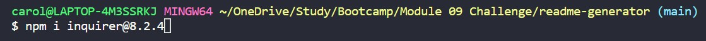
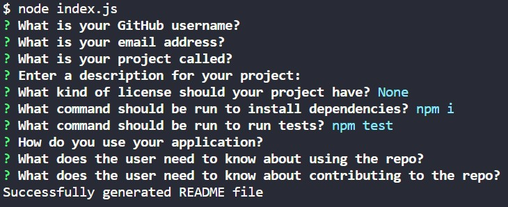

# Readme File Generator
## Description
Generate a README.md file
## Table of Contents
1. [Installation](#installation)
1. [Usage](#usage)
1. [License](#license)
1. [Contribution](#contribution)
1. [Testing](#testing)
1. [Questions](#questions)
## Installation
To run this application, you must run command 'npm i' to install dependencies.
## Usage
Follow and answer the prompts to generate a README file with the user input
## License
The product is licensed under the MIT license.
## Contribution
User can contribute by creating pull request for approval
## Testing
To test the application, you must run the 'npm test' command.
## Screenshots
  
Install dependencies  
  
  
Using the application  
## Questions
### Where can I find the repo?
Follow the link: [https://github.com/carolinemae](https://github.com/carolinemae)
### How can I contact the creator if I have questions?
Contact via email: [carolinemaee@live.com](mailto:carolinemaee@live.com)